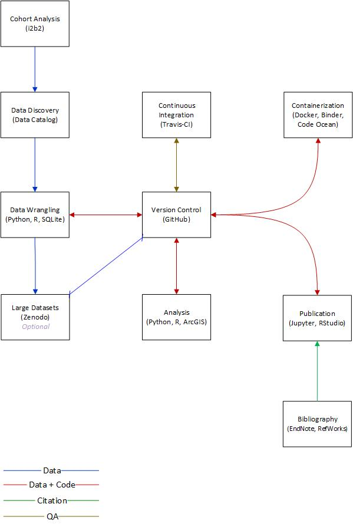

*It takes a system to achieve reproducibility: Designing an integrated big data research system to support precision health researchers*

### The 21st Century Public Health Research System
The opportunity is for academic research libraries to design and develop integrated research systems for our clients.  Most organizations in the scientific computing space offer training in specific tools such as GitHub, Python, or R -- the Carpentries being the most prominent player.  However, few talk about integrating the pieces into a whole which is greater than the sum of its parts.  In other words, primary investigators today must not only master the technical details of the tools they use but they must also act as system designers, ensuring that workflow processes are properly designed and maintained.  It is rare that one uses a tool in isolation.  Normally a variety of tools must be configured to work together.  For example, RStudio supports the creation of projects but one also needs to track versions of project components in GitHub or a similar system. 

### Big Data
In recommendation # 5 of their article, *Transforming Epidemiology for 21st Century Medicine and Public Health*, Khourey et al (2013) write, "The development of systematic approaches to robustly manage, integrate, analyze, and interpret large complex data sets is **crucial** (p. 14).  Furthermore, the authors recognize that this challenge requires not only expertise but political acumen as well.

### Integrated Knowledge Management
Khourey et al (2013) favor a knowledge integration approach to "drive research, policy and practice" (p. 14).  According to the authors, "knowledge management is a continuous process of identifying, selecting, storing, curating, and tracking relevant information across disciplines" (p. 15).  This therefore entails the selection and curation of articles, systematic reviews, and meta-analysis.

### Literature Review
Khoury, M J, et al (2013). Transforming Epidemiology for 21st Century Medicine and Public Health.  *Cancer Epidemiology, Biomarkers & Prevention,22*(4), 508–516.  doi:  10.1158/1055-9965.EPI-13-0146

